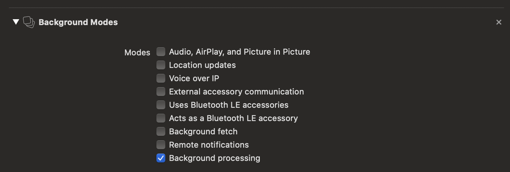

# react-native-nitro-background

This library is reworked fork of [react-native-background-actions](https://github.com/Rapsssito/react-native-background-actions) by [Rapsssito](https://github.com/rapsssito).

Powered by Nitro

## Installation

```sh
npm install @nfsmonstr/react-native-nitro-background react-native-nitro-modules

> `react-native-nitro-modules` is required as this library relies on [Nitro Modules](https://nitro.margelo.com/).
```

Linking the package manually is not required anymore with [Autolinking](https://github.com/react-native-community/cli/blob/main/docs/autolinking.md).

### Android

You need to add `POST_NOTIFICATION` permission to your android manifest, and request this permission before running tatsks
```xml
    <uses-permission android:name="android.permission.POST_NOTIFICATIONS" />
```

### iOS

1. Install pods: `cd ios && pod install && cd ..`
2. The background support requires you to activate the background capability in Xcode. 
3. To support submitting the app to the App store you need to add the following to your Info.plist:
   ```xml
     <key>BGTaskSchedulerPermittedIdentifiers</key>
     <array>
         <string>$(PRODUCT_BUNDLE_IDENTIFIER)</string>
     </array>
   ```
---

## Usage

### Example code

```js
import BackgroundService from '@nfsmonstr/react-native-nitro-background';

const sleep = (time) => new Promise((resolve) => setTimeout(() => resolve(), time));

// You can do anything in your task such as network requests, timers and so on,
// as long as it doesn't touch UI. Once your task completes (i.e. the promise is resolved),
// React Native will go into "paused" mode (unless there are other tasks running,
// or there is a foreground app).
const veryIntensiveTask = async (taskDataArguments) => {
  // Example of an infinite loop task
  const { delay, taskKey } = taskDataArguments;
  await new Promise( async (resolve) => {
    for (let i = 0; BackgroundService.isRunning(taskKey); i++) {
      console.log(i);
      await sleep(delay);
    }
  });
};

const options = {
  notificationOptions: {
    channelName: 'My notification channel',
    channelDescription: 'My notification channel description',
    channelId: 'MY_CHANNEL_ID',
    taskTitle: 'ExampleTask title',
    taskDesc: 'ExampleTask description',
    taskIcon: {
      name: 'ic_launcher',
      type: 'mipmap',
    },
    color: '#ff00ff',
    linkingURI: 'yourSchemeHere://chat/jane', // See Deep Linking for more info
  },
  parameters: {
    delay: 1000,
    taskKey: 'MY_TASK',
  },
};


BackgroundService.start('MY_TASK', veryIntensiveTask, options);
BackgroundService.updateNotification('MY_TASK', {taskDesc: 'New ExampleTask description'}); // Only Android, iOS will ignore this call
// iOS will also run everything here in the background until .stop() is called
BackgroundService.stop('MY_TASK');
```

```
If you call stop() on background no new tasks will be able to be started!
```

### Options
| Property              | Type                                                                          | Description                      |
|-----------------------|-------------------------------------------------------------------------------|----------------------------------|
| `notificationOptions` | [`<NitroBackgroundNotificationOptions>`](#NitroBackgroundNotificationOptions) | Options for android notification |
| `parameters`          | `<any>`                                                                       | Parameters to pass to the task.  |

#### NitroBackgroundNotificationOptions

| Property             | Type                                          | Description                                                                                                                                                                    |
|----------------------|-----------------------------------------------|--------------------------------------------------------------------------------------------------------------------------------------------------------------------------------|
| `channelId`          | `<string>`                                    | Notification channel id suffix.                                                                                                                                                |
| `channelTitle`       | `<string>`                                    | Notification channel title.                                                                                                                                                    |
| `channelDescription` | `<string>`                                    | Notification channel description.                                                                                                                                              |
| `taskTitle`          | `<string>`                                    | **Android Required**. Notification title.                                                                                                                                      |
| `taskDesc`           | `<string>`                                    | **Android Required**. Notification description.                                                                                                                                |
| `taskIcon`           | [`<TaskIconOptions>`](#TaskIconOptions)       | **Android Required**. Notification icon.                                                                                                                                       |
| `color`              | `<string>`                                    | Notification color. **Default**: `"#ffffff"`.                                                                                                                                  |
| `linkingURI`         | `<string>`                                    | Link that will be called when the notification is clicked. Example: `"yourSchemeHere://chat/jane"`. See [Deep Linking](#deep-linking) for more info. **Default**: `undefined`. |
| `progressBar`        | [`<ProgressBarOptions>`](#ProgressBarOptions) | Notification progress bar.                                                                                                                                                     |

#### TaskIconOptions

**Android only**

| Property       | Type       | Description                                                                                                                                          |
|----------------|------------|------------------------------------------------------------------------------------------------------------------------------------------------------|
| `name`         | `<string>` | **Required**. Icon name in res/ folder. Ex: `ic_launcher`.                                                                                           |
| `type`         | `<string>` | **Required**. Icon type in res/ folder. Ex: `mipmap`.                                                                                                |
| `icon_package` | `<string>` | Icon package where to search the icon. Ex: `com.example.package`. **It defaults to the app's package. It is highly recommended to leave like that.** |


#### ProgressBarOptions

**Android only**

| Property        | Type        | Description                                   |
|-----------------|-------------|-----------------------------------------------|
| `max`           | `<number>`  | **Required**. Maximum value.                  |
| `value`         | `<number>`  | **Required**. Current value.                  |
| `indeterminate` | `<boolean>` | Display the progress status as indeterminate. |


## Contributing

See the [contributing guide](CONTRIBUTING.md) to learn how to contribute to the repository and the development workflow.

## Special thanks

[Rapsssito](https://github.com/rapsssito) for developing [react-native-background-actions](https://github.com/Rapsssito/react-native-background-actions)

[mrousavy](https://github.com/mrousavy) and [Margelo](https://github.com/margelo) for [Nitro Modules](https://github.com/mrousavy/nitro)


## License

MIT

---
